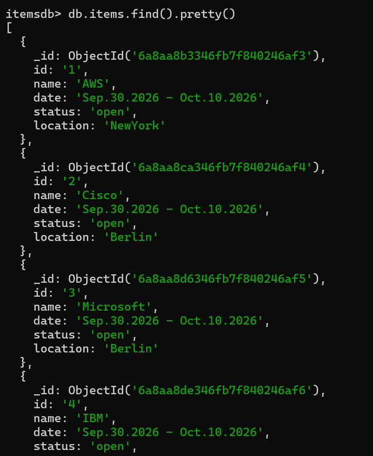
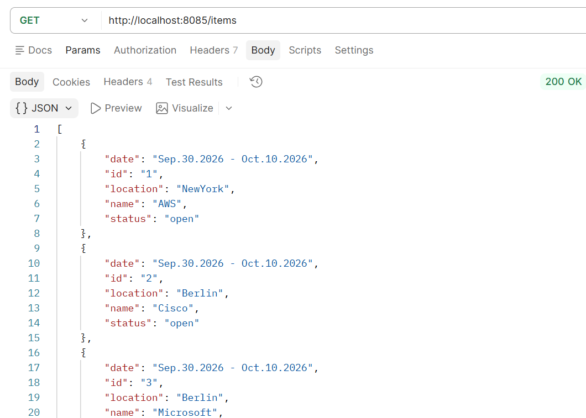
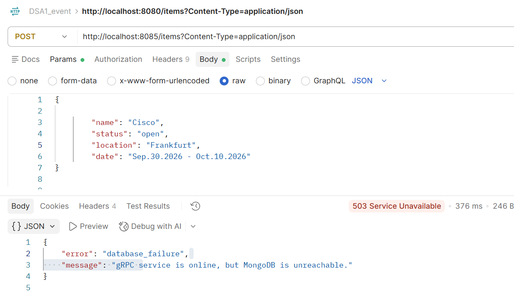
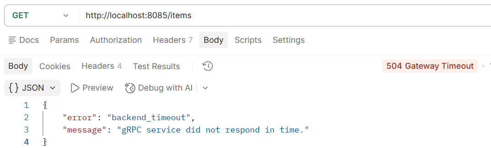
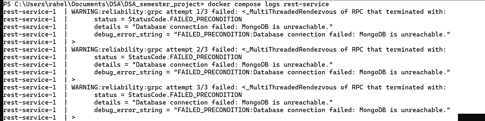
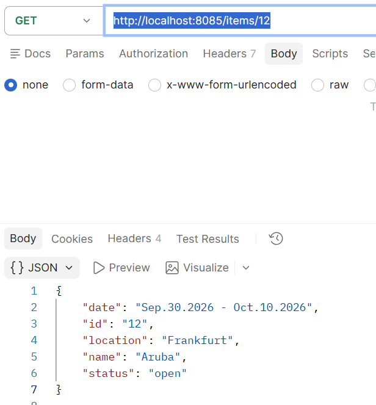

# System Architecture

REST Service (rest-service): Serves as the public interface listening on port 8085 (internal 5000). It processes incoming HTTP requests and communicates with the gRPC service via gRPC protocol.

gRPC Service (grpc-service): Backend service running on port 50051. Handles core business logic and interacts directly with the MongoDB database.

MongoDB (mongodb): Persistent database running on port 27017 to store items data.

# 1 . setup our requirements.txt file. 

Flask==3.1.3 -  for rest service
waitress==3.0.2 - for rest service
grpcio>=1.83.0 - for grpc service
protobuf>=7.35.0 - for grpc service
pybreaker==1.4.1 - circuit breaker

# 2. setup Docker compose file

Here, we have the three services, along with their version and requirement

# 3. We will import items_pb2_grpc and items_pb2, on rest.py and server.py

# 4. --build grpc-service, rest-service, MongoDB service

docker compose up -d --build

# 5. docker compose ps -a -- all the service that we have

PS C:\Users\rahel\Documents\DSA\DSA_semester_project> docker compose ps -a
NAME                                  IMAGE                               COMMAND                  SERVICE        CREATED       STATUS                       PORTS
dsa_semester_project-grpc-service-1   dsa_semester_project-grpc-service   "python server.py"       grpc-service   3 weeks ago   Exited (137) 2 minutes ago
dsa_semester_project-mongodb-1        mongo:8.0                           "docker-entrypoint.s…"   mongodb        3 weeks ago   Exited (255) 3 weeks ago     0.0.0.0:27017->27017/tcp
dsa_semester_project-rest-service-1   dsa_semester_project-rest-service   "python app.py"          rest-service   3 weeks ago   Exited (255) 3 weeks ago     0.0.0.0:8085->5000/tcp

# 6. Docker compose start - This will start the all three services

PS C:\Users\rahel\Documents\DSA\DSA_semester_project> docker compose start
[+] Running 3/3
 ✔ Container dsa_semester_project-mongodb-1       Healthy                                                                       8.1s
 ✔ Container dsa_semester_project-grpc-service-1  Healthy                                                                       6.0s
 ✔ Container dsa_semester_project-rest-service-1  Started                                                                       0.6s
PS C:\Users\rahel\Documents\DSA\DSA_semester_project>

# 6. Access mongodb

docker exec -it dsa_semester_project-mongodb-1 mongosh

test> show dbs
admin     40.00 KiB
config   164.00 KiB
itemsdb  108.00 KiB
local     80.00 KiB
test> use itemsdb
switched to db itemsdb

Items in DB

# Error messages 

Error responses:

| HTTP | status              | error field                                            | Meaning |
| 503  | database_failure    | gRPC service is up, but MongoDB is unreachable         |         |
| 409  | conflict            | Item with that id already exists                       |         |
| 502  | backend_failure gRPC| service itself did not respond                         |         |
| 504  | backend_timeout     | gRPC service responded too slowly                      |         |
| 503  | backend_unavailable | Circuit breaker is open after repeated recent failures |         |

# connect and read from the DB

docker compose exec mongodb mongosh itemsdb # connect to DB
itemsdb> db.items.find().pretty() # read from DB
# 7. GET item

# 7. DB failure

# 8. grpc failure

part 2

# Which failure was visible to the client?

Only a translated, generic error reached the client. never the raw exception. Depending on what was actually down, the client (Postman) saw one of:

503 { "error": "database_failure", "message": "gRPC service is online, but MongoDB is unreachable." } - when mongodb was stopped but grpc-service was still up.

502 { "error": "backend_failure", "message": "gRPC service did not respond successfully." } — when grpc-service itself was stopped.

503 { "error": "backend_unavailable", "message": "gRPC service is temporarily unavailable." } — once the circuit breaker had opened (see below), regardless of which dependency originally failed.

The client never sees the raw pymongo exception type, the specific gRPC status code, or how many retries were attempted — the REST layer (handle_backend_error() in app.py) collapses all of that into one of the JSON shapes above.

But inside the rest-service log - we can see the exact failure reason, along with number of attempts

Use command - docker compose logs rest-service

# Write five to eight sentences explaining your choice: when the database or gRPC service is un available, do you prefer to fail fast, retry briefly, or queue work for later? For this lab, failing fast after bounded retries is usually the cleanest choice.

For this system, I prefer failing fast after a small number of bounded retries, which is what reliability.py implements. A single retry or two absorbs the transient blips a dropped packet, a brief connection hiccup — without making the user wait unnecessarily, but retrying indefinitely just delays an inevitable failure while tying up server threads and client connections. 

Queuing the work for later would be the wrong shape for this kind of request: these are synchronous read/write operations (GET /items, POST /items) where the client is sitting there waiting for an answer, not a background job that can tolerate being processed minutes later. Failing fast also plays well with the circuit breaker: once retries are exhausted a few times in a row, the breaker opens and short-circuits further attempts entirely, so the service stops hammering a dependency that's already struggling and instead returns an honest, immediate 503 rather than piling up timeouts.

 That combination brief bounded retries for genuine transient failures, then fail-fast via the breaker for sustained outages gives the best of both worlds: resilience to the small, common failures without masking a real, ongoing outage behind minutes of silent retrying. It's also simpler to reason about and debug than a queuing approach, which would introduce its own failure modes (queue backlog, eventual consistency, retry storms after recovery) that this lab's scope doesn't call for.

 # Curiosity Evidence -Include one short paragraph and one screenshot or terminal output showing that your selected extension works.

 Have  chossen to - Add a GET /items REST route that calls gRPC ListItems instead of reading local memory. GET-ITEM 

 

